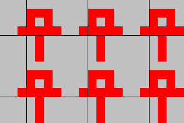

# CodexCodingEvent
Welcome to the CodexCodingEvent! In this file, you will find all information about this event.

## Overview
The main challenge is to write an algorithm solving a certain problem described in detail in chapter [Challenge](#challenge).
The basic idea is to find out the layout of labyrinths.

There is a server with some example labyrinths. You can test your algorithm by letting it solve one of the labyrinths on that server.
(Details on how to communicate with the server are in chapter [Network protocol](#network-protocol),
but there is a template relieving you of implementing the protocol yourself; see next paragraph.)

If you want to begin with implementing your algorithm right away, and want to use Java for this challenge,
you can download a template containing all code neccessary for communicating with the server. Details are in chapter [Template](#template).

There also is a scoreboard on which you will show up when solving one of the labyrinth on the server.
(You don't actually have to have solved an example to show up; it is enough to try.)
The scoreboard will compare how good your algorithm was, based on how many steps it took. Details are in chapter [Scoring](#scoring).

## Credits
This challenge is heavily inspired by the game Codex by [Daniel Linssen](https://managore.itch.io/), see https://managore.itch.io/codex.
How the colors work and how the player can interact with the labyrinth is his idea.
Also, the labyrinths the server tests clients with are the levels from his game.

Note that this also means reading the following challenge description will take much of the fun out of his game.

## Meta rules / information
### Privacy
The only personal information the downloadable template sends to the challenge server
are the username and password entered in `LabyrinthSolver` (see chapter [Template](#template)).
Apart from that, only challenge-related actions are sent; concretely:
starting a challenge, looking, moving, and reporting a solution.
For more details, see chapter [Network protocol](#network-protocol).

This can be verified by reading the tmeplate's source code; specificially the classes
`net.haspamelodica.codex.codingevent.session.SessionOverSocket` and `codexcodingevent.MainSolveOne`.

The server keeps logs about all performed actions.

### Communication
Communication happens via the Zulip channel [#Codex-Codingevent](https://zulip.in.tum.de/#narrow/stream/301-Codex-Codingevent),
and via the BBB room https://bbb.rbg.tum.de/dan-st1-tz9-kvj.

Feel free to ask questions there! If you have a question while I am not in the BBB room, ask in Zulip.
If you have a question others shouldn't be able to see, write to me (Daniel Kirschten / ge49ret).

### Schedule
The event happens from April 7th to 10th.

Starting on the second day, the BBB room and the challenge server will be open from 10:00 to 22:00.
On the first day, the BBB room will be opened shortly before the challenge is explained,
and the challenge server will be started when I am finished explaining.

### Other programming languages
Other programming languages (than Java) are allowed, but you will have to reimplement the network protocol yourself.
Still, reading chapter [Template](#template) could be useful.

### Teams
Solving this challenge in a team is allowed, but please use only one shared username (and password) and begin your username with "(Team)".

### Working without the server
You are allowed to work on your labyrinth solver if the server is not running (at night between event days),
but you will have to implement the labyrinth logic yourself.

## Challenge
### Labyrinth
You control a player inside a labyrinth. The labyrinth is a two-dimensional, infinitely big, periodic field of blocks.

Periodic means the labyrinth repeats after `width` blocks horizontally and after `height` blocks vertically.
Because of this, one `width`&times;`height` tile is enough to describe the entire labyrinth.
In other words, the labyrinth is a `width`&times;`height` torus.

The x axis goes from left to right, with smaller coordinates left.
The y axis goes from up to down, with smaller coordinates up.

The `width` and `height` of the labyrinth are known.

### Blocks
Every block is colored either black or red. When a challenge starts, your player will start standing on a randomly-chosen red block.
As we will see later, the player will always stand on red blocks, never on black ones.

### Looking and Moving
There are two ways of interacting with the labyrinth: looking and moving.
The player can look and move in any direction.
(Possible directions are horizontal, vertical, and diagonal: up, up right, right, down right, ..., up left)

#### Looking
When looking in a direction, the player will see the color of the block next to the player in that direction.

#### Moving
When moving in a direction, the player will not neccessarily end up on the block next to the player.
Instead, the player will continue moving in that direction until a red block is reached.
(This is why the player will always stand on red blocks.)
In other words, black blocks are covered in slippery oil.

The player does not know how many black blocks were moved over.

### Goal
The goal is to find out what the labyrinth looks like.
More formally, you have to find out the color of every block of one `width`&times;`height` tile of the labyrinth.

There are many different ways to divide a labyrinth into repeating tiles. All tilings are counted as correct.

It is guaranteed that there exists a unique solution (except for different tiling possibilities).

### Example
An example labyrinth (with `width` 7 and `height` 7) may look like the following:

(To keep this file smaller than &infin; gigabytes, only a portion of the labyrinth is shown.)

Let's say the player stands on the block marked with a black dot.
Then the player can see the blocks marked green (by looking), and move to the blocks marked blue:

This labyrinth can be tiled in 49 ways. Here are two of them, along with a single tile in the form it should be returned to the server:

 

 

## Template
The template contains everything you need to quickly get started solving this challenge, if you want to solve it using Java.
Compiling the template requires at least Java 10.

The only class you need to modify is `codexcodingevent.LabyrinthSolver`.
Modifying other classes from the template is allowed, but is neither reccommended nor neccessary for solving the challenge.

### Setting up
First, you should enter your username and a password.

#### Username
You will be shown to other participants by your username. Once you choose a username, you can no longer change it.

#### Password
**Do not reuse a password you use elsewhere!** Passwords are stored and transmitted as unencrypted plaintext.
The password doesn't have to be very secure. It exists just to avoid other participants from deliberately logging in with your username
to degrade your score.

### Writing a labyrinth solving algorithm
Write your algorithm in `LabyrinthSolver.solve`. The width and height of one tile are accessible as field members.
Move and look by calling `move` and `look` on the field member `labyrinthPlayer`.
Return your solution as an instance of `LabyrinthTile`.

You can also put code into the constructor of `LabyrinthSolver`.
It is guaranteed a new instance of `LabyrinthSolver` is created for each solution attempt.

If your code gets too long, consider splitting it into multiple classes. Keep in mind that in order for the provided main classes to work,
the entry point for your algorithm needs to stay in `LabyrinthSolver.solve`,
and the signatures of `solve` and the constructor of `LabyrinthSolver` need to stay unchanged.

Your algorithm must perform at least one action (moving or looking) every 30 seconds, otherwise the attempt counts as canceled.
(The server uses a timeout of 30 seconds for incoming messages to detect lost connections.)

### Main classes
There are two main classes: `codexcodingevent.MainSolveOne` and `codexcodingevent.MainSolveUntilCancel`.

#### `MainSolveOne`
Running `MainSolveOne` will call your labyrinth solving algorithm once with a randomly chosen labyrinth.
When your algorithm is finished, an evaluation of your solution is printed to the console.
The evaluation will also show up on the scoreboard.
See chapter [Scoring](#scoring) for a description of what the evaluation contains and how it shows up on the scoreboard.

If you stop the program (in Eclipse by pressing the red square) before it is finished,
the attempt will show up as a canceled attempt in the scoreboard.

#### `MainSolveUntilCancel`
Running `MainSolveUntilCancel` will solve challenges using your algorithm (and print the resulting evaluations) in an endless loop.

This loop can be interrupted by sending any input to the program. (In Eclipse this can be done by pressing Enter in the Console view.)
The current attempt will be finished. Therefore, interrupting the loop this way won't cause a canceled attempt in the scoreboard.

Stopping the program is not reccommended as it will show up as a canceled attempt in the scoreboard.

### Labyrinth model classes
The classes in `net.haspamelodica.codex.codingevent.labyrinth` correspond to the concepts explained
in chapter [Challenge](#challenge).
You will need to use them for interacting with the labyrinth and returning your solution.

### Other classes
The classes in `net.haspamelodica.codex.codingevent.session` and `...codingevent.challenge` are used
by the main classes for communicating with the server. They are not important for solving the challenge.

## Scoring
### Evaluation
The evaluation of a solution consists of some statistics about how well your algorithm performed.

#### Correctness
If the solution your algorithm returned does not match the real labyrinth, the solution counts as incorrect.

If your algorithm found the real labyrinth, but the path (sequence of moves and looks) your algorithm took
also would have been possible for a different labyrinth, the solution also counts as incorrect.
In other words, this means your algorithm thought it has unambiguously determined the labyrinth when it hasn't.

Correct means your solution matches the real labyrinth (except if the case described above occurs).

#### Move over red count
The number of moves your algorithm performed where the player did not step over a black block.
In the example image in chapter [Example](#example) these are up left, up, down left, down, down right.

#### Move over black count
The number of moves your algorithm performed where the player stepped over at least one black block.
In the example image in chapter [Example](#example) these are left, up right, right.

#### Look count
The number of look operations your algorithm performed, independent of whether the seen block was black or red.

#### Total cost
A weighted sum of the move over red count, move over black count, and look count.
Moves over red cost 30, moves over black cost 400, and looks cost 30.

### Scoreboard
The current scoreboard can be viewed under http://139.59.215.82:1338/.
At the end of each day the final scoreboard is posted to the Zulip channel as a CSV file.

#### Scores
The main function of the scoreboard is to assign to each participant a score for every labyrinth as well as a summarized score.
A score of 1.0 is defined to be the average; lower scores are better, higher scores are worse.
How these scores are calculated is described in detail in chapter [Score calculation](#score-calculation).

#### Graphical representation
The scoreboard is displayed as a table where rows are participants and columns are labyrinths.
The first column (labeled "summary") does not correspond to a labyrinth, but is used for displaying summarized statistics.

For the numbers displayed in each cell, only statistics applying to the participant of that cell's row
and the labyrinth of that cell's column are counted.
- In the top left corner of each cell, the score is shown.
- In the top right corner, the number of attempts is shown as two or three integers: The first integer is the number of correct attempts,
the second one the number of incorrect attempts, the third one the number of canceled attempts.
If there are no canceled attempts, the third integer is hidden.
- In the bottom, the minimum cost for a single attempt (see chapter [Total cost](#total-cost) is shown left; the maximum cost right.
These values are not calculated for the summary column, because they wouldn't be meaningful as different labyrinths differ in diffculty.

### Score calculation
1. First, an average cost is calculated for each labyrinth for each participant as the average mean of all attempts of that participant
for that labyrinth resulting in a correct evaluation.

2. Then, an average cost is calculated for each labyrinth as the arithmetic mean of all average costs for that labyrinth (from step 1).
If a participant has no (correct) attempt for a labyrinth, that participant's mean cost naturally is not included here as it doesn't exist.
The mean costs of all participants are counted with equal weight, even if one participant has multiple (correct) attempts for a labyrinth.
This is to avoid participants with more attempts having a greater effect on the scores than participants with fewer attempts.

3. Next, a score is calculated for each attempt of every participant by dividing each attempt's cost by the mean cost
for that attempt's labyrinth (from step 2).

4. Next, the scores for each participant for each labyrinth are calculated as the arithmetic mean of all (correct) attempts
of that participant for that labyrinth.

5. Similarily, the summarized scores for each participant are calculated
as the arithmetic mean of all (correct) attempts of that participant.
Note that, unlike in step 2, multiple attempts for the same labyrinth are counted as multiple attempts here.

## Network protocol
You only need to read this chapter if you don't want to use the template.

The server is reachable via a TCP socket over IPv4 on port 1337. Its address is 139.59.215.82.

### Messages
Communication between client and server consists of messages.
Every message consists of a request from the client to the server and a response from the server to the client.

A request consists of a single message type byte and optionally some data.

A response consists of a single status byte and, if the status is `SUCCESS`, optionally some data.
If the status is an error status (anything except `SUCCESS`), the response doesn't contain data even if the message type requires data.
Also, the server never sends anything after an error response.

A request is always followed by exactly one response. Also, the server never sends a response of status `SUCCESS` to the client
without the client sending a request first. (The server does sometimes send error responses without a request, for example `TIMEOUT`.)

### Session lifecycle
If any message type is used when the server does not expect it, `INCORRECT_STATE` is responded.
If no request arrives within 30 seconds after the last response was sent, the server sends a `TIMEOUT` response.

#### Expected message sequence
1. The first message has to be `LOGIN_OR_REGISTER`.\
  The server responds with `SUCCESS` only if the login was successful or the participant was registered successfully.
  Otherwise, it responds with an appropriate error response.
2. The next message has to be `START_CHALLENGE`.\
  The server randomly chooses a labyrinth and responds with its width and height.
  Internally, a start position is chosen randomly as well.
3. Now, `MOVE` and `LOOK` can be used any number of times (including zero).\
  `MOVE` causes the server to to move the current attempt's player in the specified direction,
  according to the rules from chapter [Challenge](#challenge).\
  `LOOK` causes it to let the player look in the specified direction according to chapter [Challenge](#challenge),
  and to respond with the seen color.
4. When the client has unambiguously (except for different tilings, see chapter [Challenge](#challenge)) determined the colors of a tile,
  it should send `REPORT_SOLUTION`. The server evaluates the solution and responds with the evaluation.
  For details about the fields included in the evaluation, see chapter [Evaluation](#evaluation).
5. The client can now safely terminate the connection, or proceed with step 2.

#### Terminating
The server terminates the connection only if and as soon as it has sent an error response.

The client can terminate the connection whenever it wants to, but if the connection is terminated after a challenge was started
but before a solution was reported the attempt counts as canceled.

### Transmittable data types
Directions are transmitted as a single byte. Starting with `0x00` meaning up, directions are numbered clockwise:
`0x00` for up, `0x01` for up right, `0x02` for right etc. until `0x07` for up left.

Colors are transmitted as a single byte, `'B'` / `0x42` for black and `'R'` / `0x52` for red.

All other data types are transmitted according to Java's
[DataInput class](https://docs.oracle.com/en/java/javase/16/docs/api/java.base/java/io/DataInput.html).
For clarity, the used data types are repeated below.

There are two number types: integers and longs. Integers are 4 byte, longs are 8 byte, both are signed,
and both are transmitted in big-endian, meaning high byte first.

Booleans are transmitted as one byte: `0x01` for true and `0x00` for false.

Strings are transmitted in Java's
[modified UTF-8 format](https://docs.oracle.com/en/java/javase/16/docs/api/java.base/java/io/DataInput.html#modified-utf-8).

### Message types
- `LOGIN_OR_REGISTER` (`'R'` / `0x52`)
  - Request data:
    - `username`: `String`
    - `password`: `String`
  - Response data: none
- `START_CHALLENGE` (`'C'` / `0x43`)
  - Request data: none
  - Response data:
    - `width`: `integer`
    - `height`: `integer`
- `MOVE` (`'M'` / `0x4D`)
  - Request data:
    - `dir`: `Direction`
  - Response data: none
- `LOOK` (`'L'` / `0x4C`)
  - Request data:
    - `dir`: `Direction`
  - Response data:
    - `seenColor`: `Color`
- `REPORT_SOLUTION` (`'S'` / `0x53`)
  - Request data:
    - `width`: `integer`
    - `height`: `integer`
    - blocks: `width`&times;`height` `Color`s. These are the blocks of the reported tile, in row-major format.
      (When iterating over width and height, the outer loop should iterate over width and the inner one over height.)
  - Response data:
    - `correct`: `boolean`
    - `moveOverRedCount`: `integer`
    - `moveOverBlackCount`: `integer`
    - `lookCount`: `integer`
    - `totalCost`: `long`

### Response statuses
`SUCCESS` is `'S'` / `0x53`.
For error statuses, see `net.haspamelodica.codex.codingevent.session.ServerException.Type`.
The `Type`s in that file having `-1` as the char are only used by the client implementation and never reported by the server.
